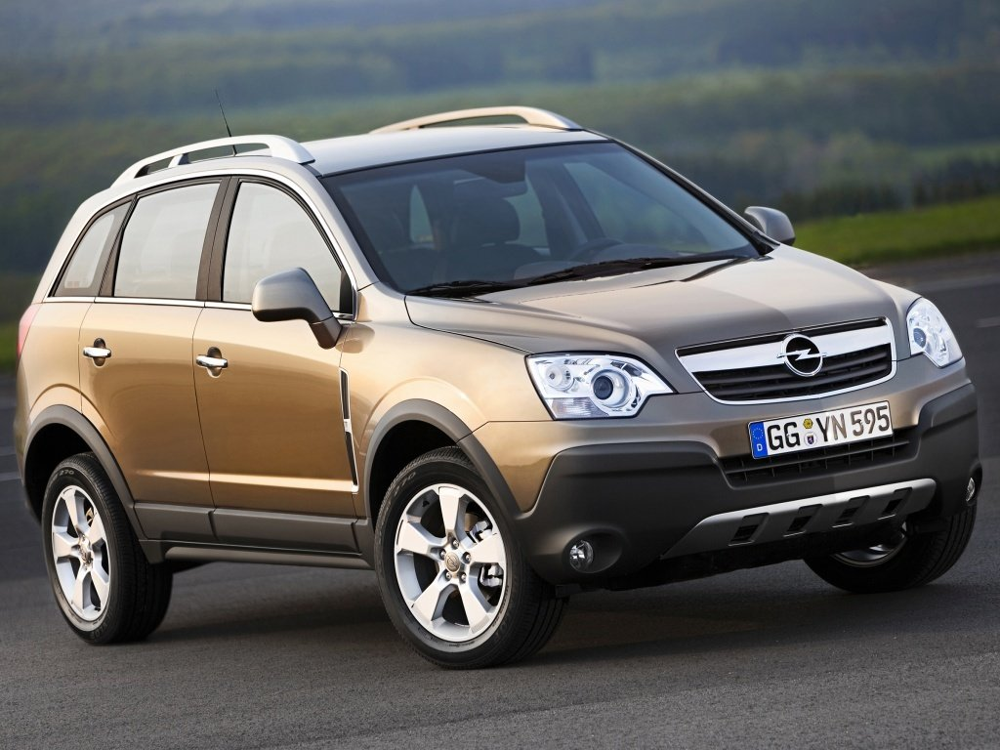

# _Я и мои автомобили_

Меня зовут Кирилл, мне 27 лет. Мой путь автовладельца начался в 2013 году.

### _Список автомобилей которыми я владел_

* Копейка (ВАЗ 2101) 1973 года
* Subaru forester 2002 года
* Opel Antara 2014 года

### _Цены и время владения_

|  Автомобиль   | Время владения  |     Цена (руб)|
|:------------- |:---------------:| -------------:|
| Копейка       | с 2013 по 2014  | щедрость деда |
| Subaru        | с 2014 по 2019  |       350000  |
| Opel          | с 2019 по н.в.  |       650000  |

### _Информация про мои машины_

1. Про копеечку есть хорошая статья на [Авторевью][1]

[1]:https://autoreview.ru/articles/primeryaem-na-sebya/vaz-2101 "ссылка тут"

2. Обзор на Форестер можно посмотреть [здесь][2]

[2]:https://autoportal.pro/otzyvy/obzor-subaru-forester-2 "ссылка тут"

3. Хочу показать [статью про концепт опеля][3] на английском языке

[3]:https://www.conceptcarz.com/vehicle/z10168/opel-antara-gtc.aspx "ссылка тут"

### _Как они выглядят_

